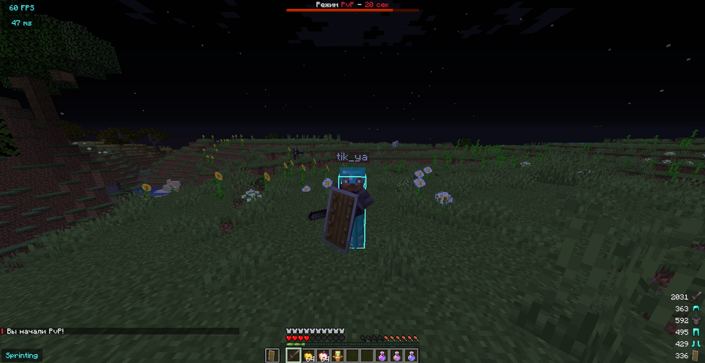

## 🛡️ PowerAntiRelog
### Features

- Easy to use
- High performance
- Best protection

### Usage
`Add the .jar file to the plugins folder and start your server.`

### Dependencies
- Paper 1.16.5+

### Supported plugins (Optional)​
- WorldGuard
- CMI
- Essentials

### Commands
- /ar help - List of commands
- /ar reload - Reloads the configuration
- /ar test {player} - Gives the player a battle mode
### Permissions
- powerantirelog.bypass - Player will not be given PvP mode
- powerantirelog.help- Access to /ar help command
- powerantirelog.reload- Access the command /ar reload
- powerantirelog.test- Access the command /ar test {player}

### Screenshots
- 
- 

### License
See the [LICENSE](LICENSE.md) file for license rights and limitations.

##### :ghost: [by Katze](https://github.com/katze225 "by Katze")
